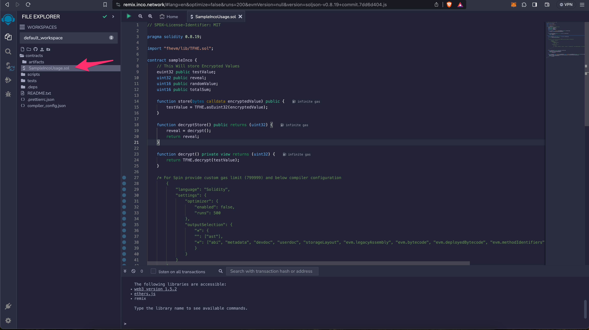
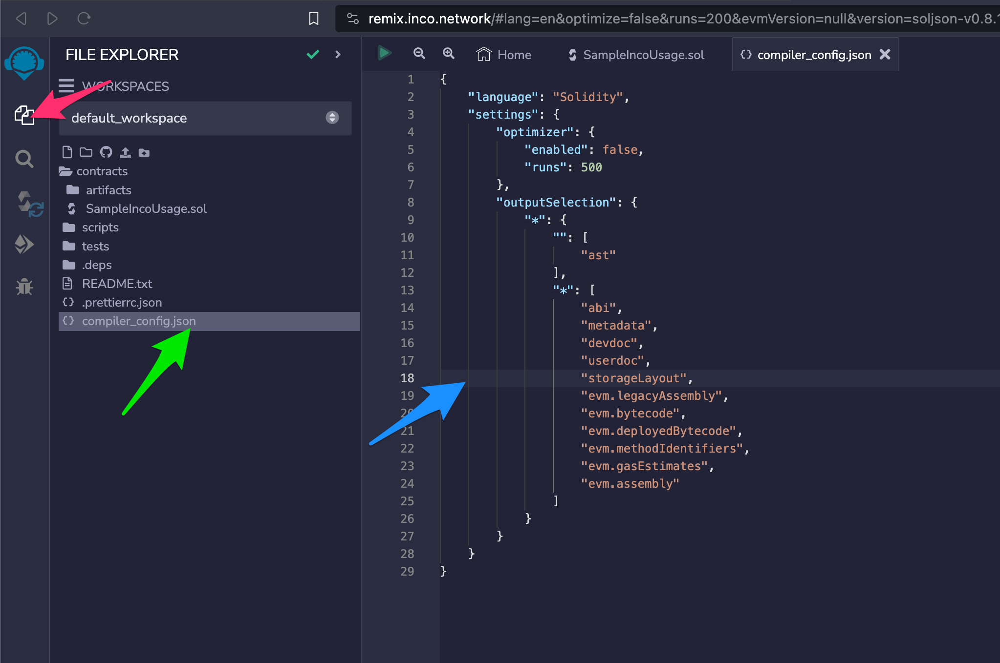
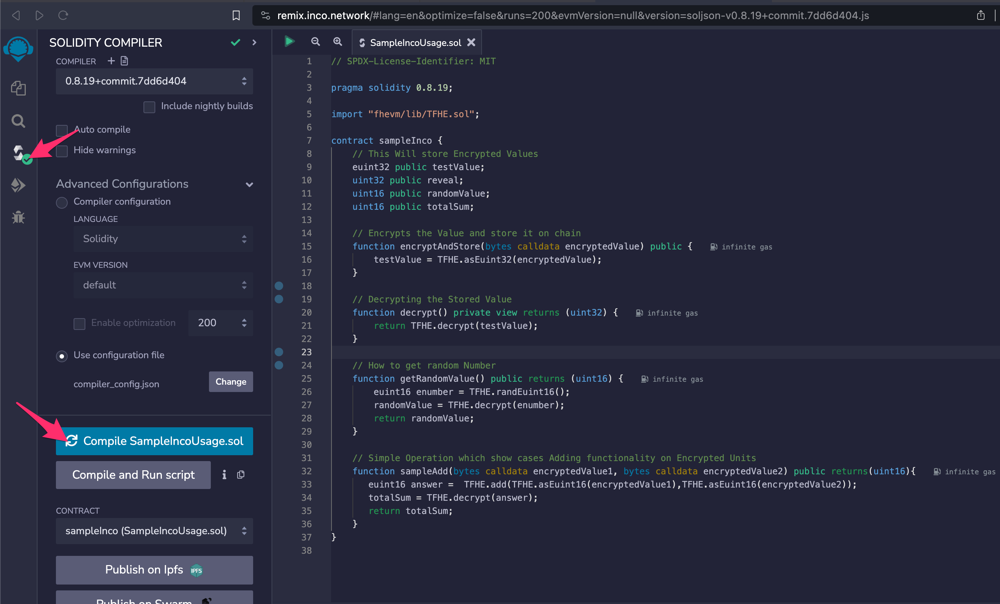
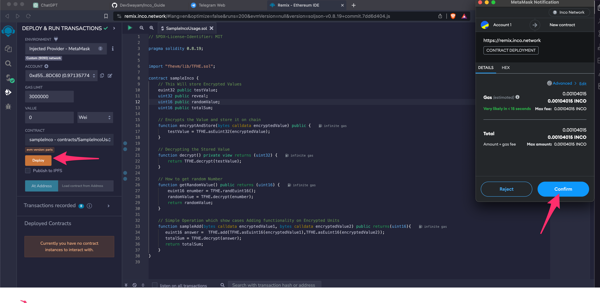

# Inco Guide: Setting Up Wallet and Accessing Inco Remix

Before proceeding, ensure that you complete the following steps: set up your wallet, acquire some test tokens, and familiarize yourself with the Remix interface.

## Step 1: Wallet Setup

1. Configure your wallet with the necessary details.
2. Ensure you have test tokens available for transactions.

## Step 2: Inco Remix

Access the Inco Remix interface, which has been customized for Inco to provide a tailored experience for interacting with and deploying smart contracts. Visit [Inco Remix](https://remix.inco.network/).

### Deploying a Simple Smart Contract

We will now deploy a straightforward smart contract that demonstrates encryption and decryption on-chain, along with how to perform operations on encrypted data, and obtaining a native random number on the chain.

After opening Remix, you will see an interface like this:



Navigate to the Contracts/ folder and either create your own contract or paste the provided code into an existing contract.

```solidity
// SPDX-License-Identifier: MIT

pragma solidity 0.8.19;

import "fhevm/lib/TFHE.sol";

contract sampleInco {

    // This will store Encrypted Value
    euint32 public testValue;

    uint32 public reveal;
    uint16 public randomValue;
    uint16 public totalSum;

    // Encrypts the Value and stores it on chain
    function encryptAndStore(bytes calldata encryptedValue) public {
        testValue = TFHE.asEuint32(encryptedValue);
    }

    // Decrypting the Stored Value
    function decrypt() private view returns (uint32) {
        return TFHE.decrypt(testValue);
    }

    // How to get a random Number
    function getRandomValue() public returns (uint16) {
        euint16 enumber = TFHE.randEuint16();
        randomValue = TFHE.decrypt(enumber);
        return randomValue;
    }

    // Simple Operation showcasing Adding functionality on Encrypted Units 
    function sampleAdd(bytes calldata encryptedValue1, bytes calldata encryptedValue2) public returns(uint16){
       euint16 answer =  TFHE.add(TFHE.asEuint16(encryptedValue1),TFHE.asEuint16(encryptedValue2));
       totalSum = TFHE.decrypt(answer);
       return totalSum;
    }
}

```

### Before Deploying Smart Contracts

You need to customize a few settings before deploying transactions.

1. Open the Solidity Compiler and change the Compiler Version to `0.8.19+`.
2. In Advanced Configuration, click on `Use Configuration File` and change it to `compiler_config.json`.

In the files section, you will see the `compiler_config.json` file:



Paste the following configuration into the `compiler_config.json` file:

```json
{
	"language": "Solidity",
	"settings": {
		"optimizer": {
			"enabled": true,
			"runs": 500
		},
		"outputSelection": {
			"*": {
				"": [
					"ast"
				],
				"*": [
					"abi",
					"metadata",
					"devdoc",
					"userdoc",
					"storageLayout",
					"evm.legacyAssembly",
					"evm.bytecode",
					"evm.deployedBytecode",
					"evm.methodIdentifiers",
					"evm.gasEstimates",
					"evm.assembly"
				]
			}
		}
	}
}
```

### Compiling and Deploying the Smart Contract

1. For Compiling Contract, click on `Solidity Compiler` section, and then Compile Contract:



2. Deploying Smart Contract on Inco Network. Navigate to `Deploy & run` Section. Click on `Deploy`, and MetaMask will pop up to confirm the transaction:



### Understanding the Code and Performing Transactions
