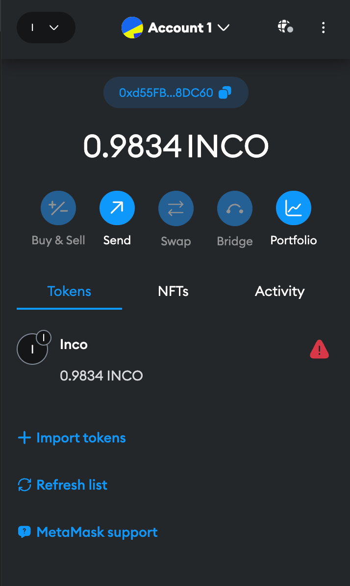
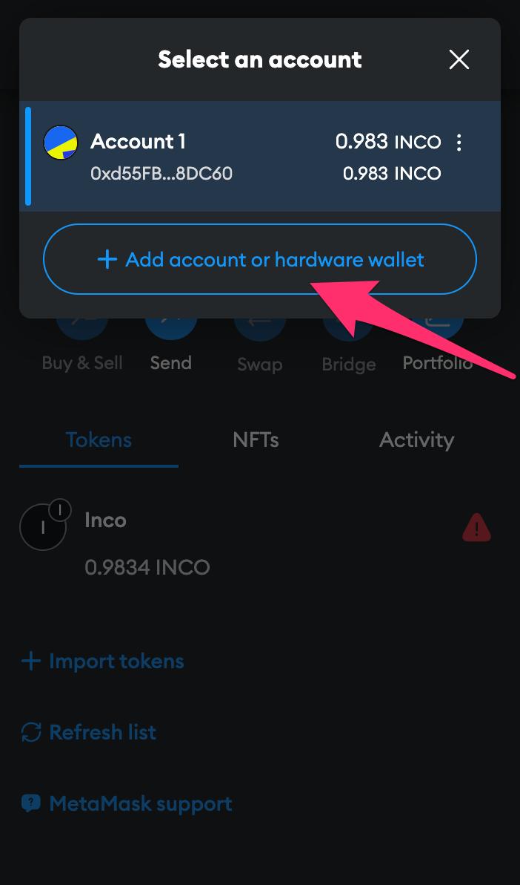
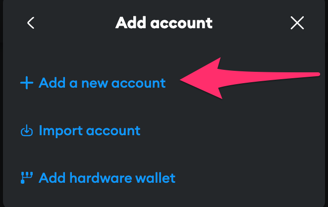
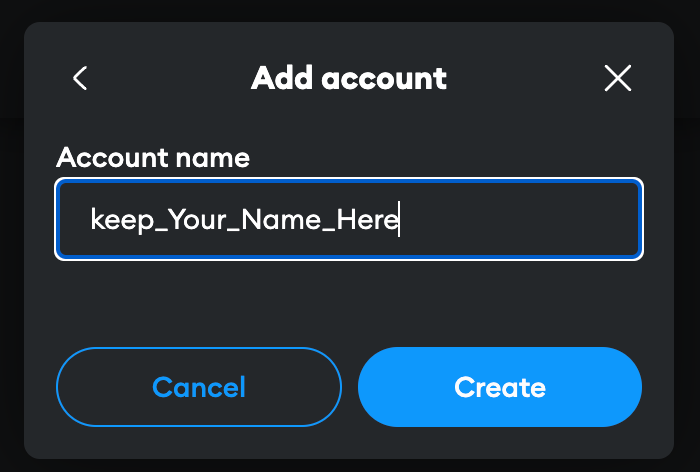
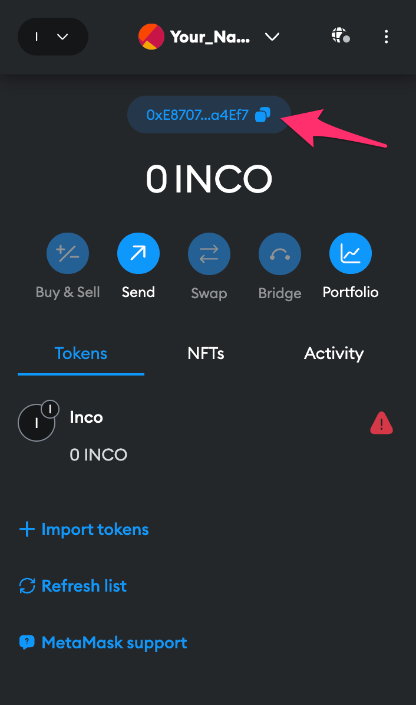
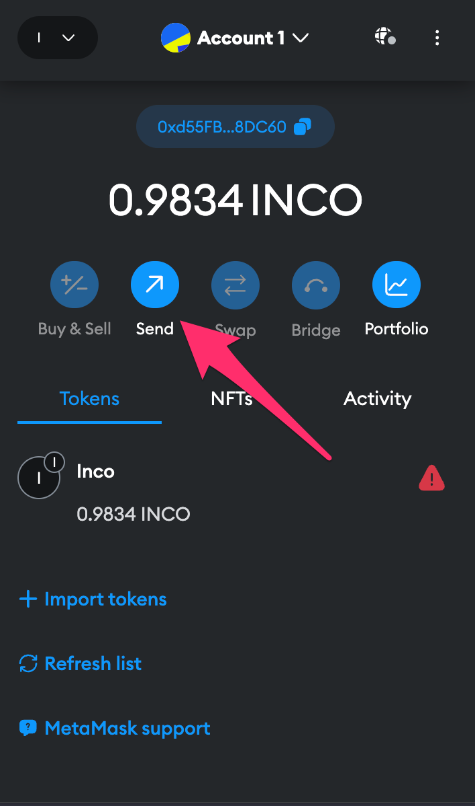
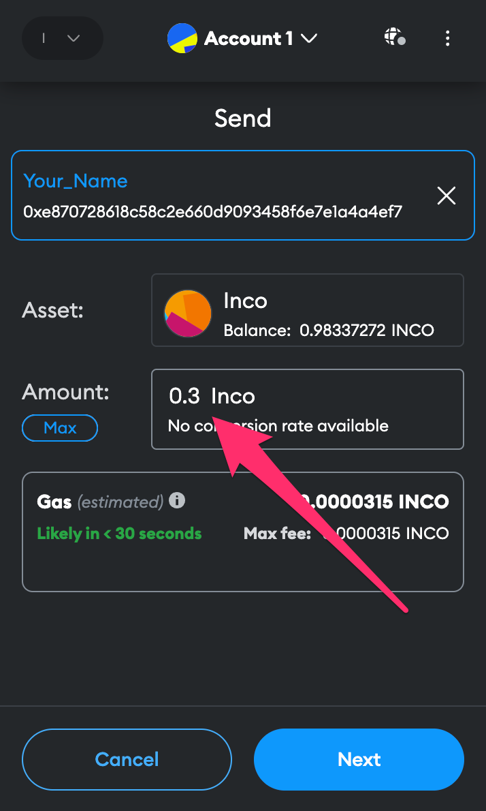

Certainly! Here's the modified guide with consistent image references and links:

# Inco Guide: Deploying Smart Contracts with Remix on Inco Network

## Wallet Setup

To interact with the Inco Network, you'll need a wallet. Follow these steps to set it up:

1. Install [Metamask](https://metamask.io/download/) on your browser.
2. After installation, set up the Inco Devnet in Metamask by following [Inco's guide](https://docs.inco.network/getting-started/connect-metamask).

## Test Tokens

To perform transactions and deploy smart contracts, you need test tokens. Get them by following the steps in the [Inco Faucet guide](https://docs.inco.network/getting-started/faucet).

## Performing Transactions

1. Open Metamask and navigate to the wallet interface.

   

2. Click on the highlighted account.

   

3. Select "Add Account" or "Hardware Wallet."

   

4. Create a new account, give it a name, and click on "Create."

   
   

5. Copy the address of the new account.

   

6. Go back to your original account with test tokens.

7. Click on "Send Token" and paste the address in the field.

   

8. Enter an amount less than your token balance, click "Next," and then "Confirm."

   

9. Switch to the new account to verify the received balance.

Now you're ready to deploy your smart contracts on Inco Network using Remix and perform transactions seamlessly.
<!-- @import "[TOC]" {cmd="toc" depthFrom=1 depthTo=6 orderedList=false} -->
